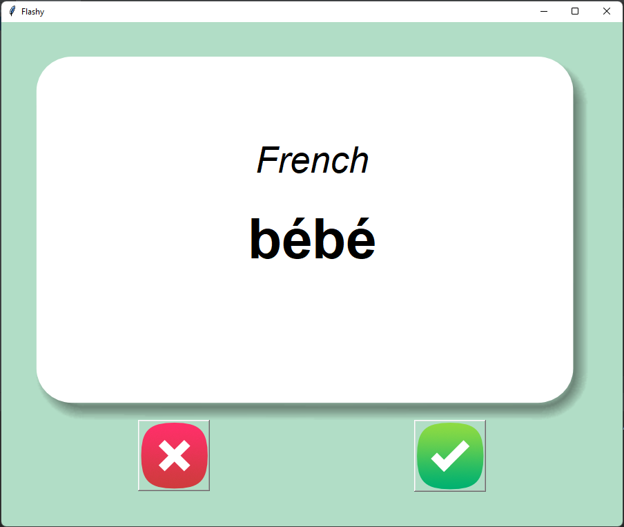
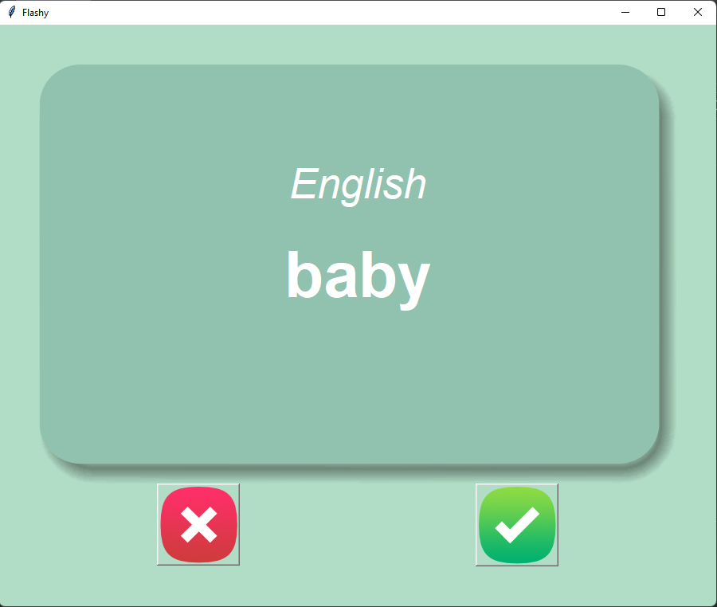

# Flash-Card-Game-For-PC
Learn French by Flash card game for PC
Link to download <a href="https://drive.google.com/file/d/1ZDYRCEo_784bPZ0nYggVe64Q2azrn8TI/view?usp=sharing">click here</a>

https://drive.google.com/file/d/1ZDYRCEo_784bPZ0nYggVe64Q2azrn8TI/view?usp=sharing

It's an App for learning French top 100 frequently using words for basic undarstanding.
GUI to navigate to next words

## How to use
1. Download zip file and unzip:-https://drive.google.com/file/d/1ZDYRCEo_784bPZ0nYggVe64Q2azrn8TI/view?usp=sharing
2. run main.exe, and happy learning

## Features
1. If you click on ✅, it's detect as you know this word and it is remove that word from your learning words. 
2. If you click on ❌, it's detect as you don't know word and it will remain in your learning words list.

EXAMPLE
        

Appréciez d'apprendre!!!
:)😊😁
